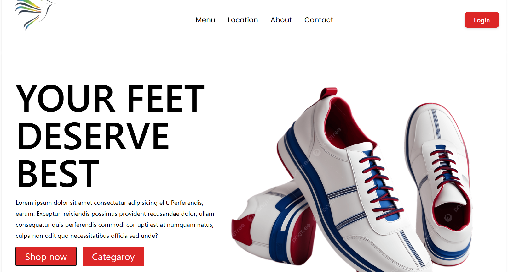

# 👟 Product Page UI – React + Tailwind CSS

A clean, modern, and fully responsive **Product Page UI** built using **React** and **Tailwind CSS**.  
This project showcases a stylish **shoe product display** section — perfect for e-commerce stores or portfolio demos.

---

## ✨ Features

- ⚡ Built with **React 18 + Tailwind CSS**
- 🖼️ Beautiful and responsive layout
- 🧩 Product image, name, description, and pricing
- 🛒 Add-to-cart button with hover animations
- 🌈 Easy to customize and expand
- 📱 Fully mobile-friendly

---

## 🖼️ Preview

Here’s what the product page looks like 👇

---

## 🛠️ Tech Stack

- ⚛️ React.js
- 🎨 Tailwind CSS
- 🧰 JavaScript (ES6+)
- 🚀 Vite 

---

## 🧩 Folder Structure

product-page-ui/
├── src/
│ ├── components/
│ │ ├── Navigation.jsx
│ │ └── Hero.jsx
│ ├── App.jsx
│ ├── index.css
│ └── main.jsx
├── public/
├── package.json
├── tailwind.config.js
├── postcss.config.js
├── .gitignore
└── README.md
